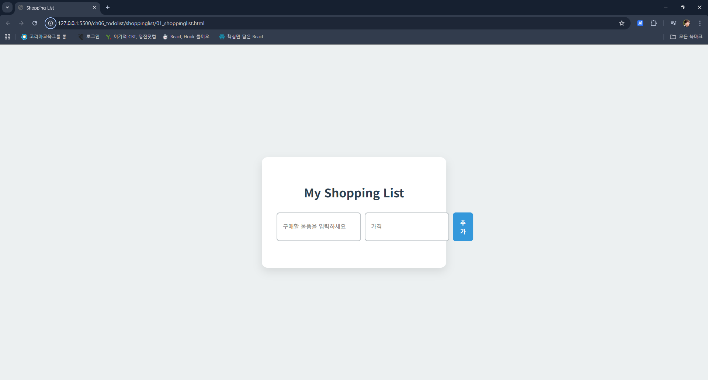

# Java Script 주요 Web API
## API?

## API 구성 요소
1. 명세(Specification) : API가 제공하는 기능 목록 및 사용방법을 정의한 문서
2. 인터페이스(Interface) : 실제로 통신을 위한 규익. 주로 HTTP 프로토콜 사용(추후 수업)

# Web API 
웹 애플리케이션 개발에 사용되는 API로, 웹 서버와 클라이언트(웹 브라우저 / 모바일 앱 등) 같의 통신을 가능하게 함

### 특징
1. HTTP 프로토콜 기반 : 웹에서 데이터를 주고 받을때 사용하는 방식으로 저희도 프로젝트할때 이용 예정
2. RESTful API : 최근에 가장 널리 사용된 웹 API 스타일로, HTTP 메서드를 사용해 데이터를 처리하는 방식
3. 데이터 형식 : 주로 JSON 사용. 혹은 XML(extensible markyup language)

### LocalStorage / SessionStorage
- HTML에서 추가된 웹 브라우저 자체 저장소.

1. LocalStorage
- 저장된 데이터를 삭제하기 전까지 영구히 보존됨(그 말은 우리가 알아서 삭제도 잘 해줘야한다는 의미)
- 저장되는 모든 데이터는 JS의 Object 처럼 key-value properties로 이루어짐
- 그런데 value의 자료형은 string으로 고정됨
- 이상의 이유로 다양한 자료형의 데이터를 저장하고자 할 때 JSON.stringify 를 이용하여 문자열로 변환시켜 저장해야함
- 반대로 LocalStorage 내의 데이터를 불러와 웹 페이지에 출력하고자 한다며 JSON.parse를 사용하여 원래 데이터 형식으로 변환해야 함
- 보안에 위배되지 않고, 영구히 저장해도 상관없는 데이터를 저장할 때 적합
  - 사용자가 마지막으로 보고있는 화면 url
  - 웹 사이트에서 사용자 테마, 개인화를 제공하는 경우 해당 정도 저장 등

01_storage 참고
```js
// localStorage 문자열 데이터와 배열 데이터를 저장하는 예시

if(typeof Storage !== 'undefined'){
  localStorage.setItem('title','review : 파이팅');
/*
  .setItem() 라는 메서드가 있고, 거기에 2개의 argument 를 집어넣었습니다. 2번째 매개변수 value의 경우 원래 string 자료형면 그대로
*/
  
  // 집어넣을 데이터 예시 - JS 배열인데, 내부 element가 객체 -> stringㅇ로 변환가정 필요
  const users = [
  {
    id : 1,
    name : '김일',
  },{
    id : 2,
    name : '김이'
  },
  ];
  localStorage.setItem('users',JSON.stringify(users))
}
```
  1. 이상의 코드 라인에서 확인 할 것은, Java에서 배웠던 setter/ getter 개념이 동일하게 사용되었음
  2. localStorage 상의 key-value 의 자료형이 둘다 고정되어 있으므로, value가 string이 외의 다른 자료형일시 변환이 필요
      - 변환 메소드 -> `JSON.stringify(데이터명);`
      - 저희는 live server 사용중이라 연동시 자동으로 되어있음

local Storage 상에 데이터가 저장되면, 같은 도메인 내에 다른 페이지에서도 저장된 데이터를 조회할 수 있게됩니다.(A사이트 로그인 창에서 id/비밀번호 입력후 authentication 적용시 A사이트 내의 다른데에서도 이용가능 하듯이)

```js
// localStorage 안에 있는 데이터 조회
if(Storage !== undefined){
  console.log(localStorage.getItem('title'));
  console.log(localStorage.getItem('users'))
  // 이경우 24~25 라인의 결과값은 자료형에 해당(string)
  // 그래서 25번 라인을 string 이용이라면 별문제가 없으나, 굳이 객체로 저장된걸 string 으로 사용할 필요는 없으니 원복하는 method가 필요
  console.log(JSON.parse(localStorage.getItem('users')));

  const usersFromLocal = JSON.parse(localStorage.getItem('users'));
  console.log(usersFromLocal);
}
// 삭제 예시
localStorage.removeItem('title');
```

알아야 할점
  1. setItem(`키`,`값`), getItem(`키`), removeItem(`키`); method 3가지
  2. value로 들어가는 데이터의 자료형
    - string 이면그대로
    - 아니면 JSON.stringify() 적용
  3. getItem 사용시 localStorage 들어가있는 value 를 전부 string이므로,
    - string이면 그대로 출력
    - 원래 형태가 string이 아니라면([],{} 시작 등), JSON.parse(`키`)
   

##  sessionStorage
  - 세션슽리지에 저장된 데이터는 브라우저를 닫으면 자동 삭제
  - method 명 동일
  - 저장되는 방식이 동일하기에 JSON>stringiry() / JSON.parse()동일 사용

# TodoList 작성
ch06_todolist
01_todolist  html / css /js
## 요구사항 명세서
1. 개요(Introduction)
이 문서는 사용자가 할 일을 효율적으로 관리할 수 있도록 돕는 투두 리스트 웹 애플리케이션의 요구사항을 명세합니다. 사용자가 할 일을 추가,관리, 삭제할 수 있는 기능을 제공하며, 웹 브라우저의 `localStorage`를 활용하여 데이터를 영구적으로 저장합니다

2. 기능 요구사항(Functional Requirements)
- 할 일 추가 (Add to Do)
  -  사용자는 텍스트 입력창(`<input>`태그)에 할 일을 입력하고 '추가' 버튼을 클릭하거나 enter를 눌러 할 일을 목록에 추가할 수 있어야 합니다.
  - 입력된 텍스트는 공백을 제거한 후 저장되어야합니다.
  - 입력 내용이 비어 있을 경우. 사용자에게 경고 메세지를 표시해야합니다.
  - 새로 추가된 할 일은 '완료되지 않음' 상태로 추가되어야 합니다.

 - 할 일 표시 (Display to Do)
    - 추가된 할 일은 순서대로 목록에 표시되어야 합니다.
    - 각 할 일 항목에는 체크박스. 할일 내용. 삭제버튼이 포함되어야 합니다.

  - 할 일 상태 변경 (Change To-Do Status):
    - 사용자는 각 할 일 옆에 체크 박스를 클릭하여 해당 할 일의 '완료'상태로 변경할 수 있어야 합니다.
    - '완료됨' 상태의 할 일은 시각적으로 구분 될 수 있도독 _취소선_ 과 _흐릿한 색상_ 이 적용되어야합니다.

  - 데이터 영구 저장 (Data Persistence): 
    - 애플리케이션은 브라우저의 `localStorage`를 활용하여 할 일 목록 데이터를 저장해야합니다.
    - 페이지를 새로고침하거나 브라우저를 닫았다가 다시 열어도 기존의 할 일 목록이 유지되어야합니다

  3. 기술 요구 사항(Technical Requirements)
    - 언어 및 기술
      - HMTL / CSS / JavaScript를 사용해야합니다.  외부 라이브러리나 프레임워큰 사용 X
      - JavaScript 내장 객체 및 메서드 활용
        - JSON 객체
        - Array 객체
        - String 객체

      - DOM 조작 :
        - document.getElementById() 를 사용하여 HTML element 선택
        - 기타 다른 document 관련 method 활용
      
      - 이벤트 처리 : 
        - addEventListner()를 사용하여 click 이벤트와 keydown 이벤트를 처리해야합니다.
        - 체크박스의 change 이벤트도 처리하여 할 일의 완료 상태를 업데이트해야합니다.

  - 디자인 및 사용자 경험(UX) :
    - 직관적인 디자인과 사용자 친화적인 레이아웃을 제공해야 합니다.
    - 모바일 기기에서도 사용가능 하도록 _반응형 디자인_ 이 적용되어야합니다.
    - 할일 추가, 상태 변경, 삭제 시 시각적 효과를 통하여 사용자가 즉삭적인 피드백을 받을 수 있어야 합니다.

## CSS 변수 명세서
1. 프로젝트의 주요 색상을 정의
  - --primary-color : #2c3e50
    - 용도 : 주요 텍스트, 제목 등 핵심 요소에 해당하는 기본 색상
  
  - --secondary-color : #3498db
    - 용도 : 상호작용 가능한 요소(버튼/ 링크 등)이나 강조를 위한 색상

  - --light-gray : #bdc3c7
    - 용도 : 비활성된 요소나 경계선(border) 등 보조적인 요소에 해당하는 밝은 회색

  - --completed-color : #95a5a6
    - 용도 : 완료된 할 일 텍스트에 사용되는 색상

2. 폰트(Typography)
- 프로젝트의 글꼴을 정의
  - --font-family : Noto Sans KR, sans-sherif
    용도 : 전체 애플리케이션에 사용되는 기본 글꼴

3. 레이아웃 및 간격 (Layout / Spacing)
- 컴포넌트의 크기와 간격을 정의
  - --container-padding : 2.5rem
    - 용도 : 메인 컨테이너의 내부 여백

  - --container-radius : 15px
    - 용도 : 메인 컨테이너의 모서리 둥글기

  - --item-padding : 15px
    - 용도 : 개별 할 일 아이템의 내부 여백
  
  - --item-radius : 8px
    - 용도 : 입력창, 버튼 할 일 아이템의 모서리 동글기
  
  - --gap : 10px
    용도 : 입력 그룹 내 요소의 간격

4. 그림자(Shadows)
- 입체감을 위한 그림자 효과를 정의합니다.

  - --container-shadow : 0 10px 25px rgba(0,0,0,0.1)
    - 용도 : 메인 컨테이너에 적용되는 그림자

  - --item-hover-shadow : 0 5px 15px rgba(0,0,0,0.05)
    - 용도 : 할 일 아이템에 마우스를 올릴 때 적용되는 그림자.  

.js 파일로 분리

왠만하면 수정하지않고
쇼핑 리스트 제작 예정
입력부분 input창을 2개로나눌예정 - 품목/가격

작성을 다했다고 가정시,
현재 01_shoppinglist.html에 01_todolist.css를 도입하였음


이렇게 생기는 문제점이 있습니다.<br>
이를 해결하기위한방법 ->
1. css파일을 하나 더만들어서, 변경내용만 추가.<br>(01_shoppinglist.css제작후, 이전 css문 복사하여 대입 및 일부 변경)
  - 수정이 잘못되어 연결되어있는 다른 프로그램(todolist)의 css가 오류가 생길수 있는것을 방지

2. 01_shoppinglist.css를 만드는것 까지는 좋으나, 이전 수업방식에서 사용하였던 방식을 이용. -> @import