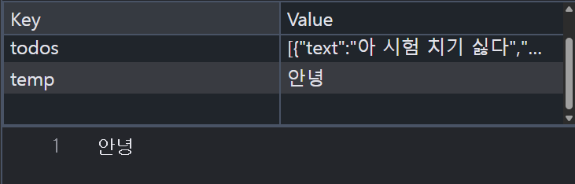

# todolist/ shoppinglist 분할

시점에 스크립트 실행

- html문서에 명시된 순서대로 실행 보장

- 로직이 복잡한건 아니라 오류시, 컴퓨터 문제일 확률 높음

# todolist 복습

localStorage 의 저장방식

- 키 - 값 쌍으로 이루어져 있고, value에는 다양한 자료형이 들어감

- todolist에는 todos라는 키에 값이 배열로 들어가있고, 내부는 js 객체 형태로 되어있음

- 하지만 모든 localStorage의 value가 배열일 필요는 없습니다,

내일부터 복습을위한 동영상 강의 수강을 요구할수 있으니. 유무선 이어폰 준비할것

# 자리 이동후

git clone 방법

1. git clone 링크
2. shift + 우클릭 -> . code
3. 폴더 경로 확인
4. 자바스크립드폴더 기준으로 시프드 우클릭 + code
  1. 이유 0> 깃이이미 잇음
  2. 푸쉬한것처럼 깃 인잇부터 시작할 필요
  3. git config user.name ""
  4. git config user.email
5. ctrl + , -> 설정 autosave -> afterdelay /onFocus 변경

로그인 및 회원가입 기능 구현 목표 3가지를 활용하여 ui 구현 및 자바스크립트로 데이터 저장 및 페이지 이동을 구현

1. singin.html
2. signup.html
3. style.css
4. sighin.js
5. signup.js
라픈 파일명을 지정.

요구사항 1
페이지 구성 로그인 페이지와 회원가입 페이지 2개의 html을 만든단
로그인 페이지에서 회원가입 링크를 클릭시. 회원가입 페이지로 이동
회원가입 페이지에서 로그인 클릭시 해당페이지로 이동

요구사항 2.
css  레이아웃 flexbox를 이용하여 중앙에 배치 버튼 입력필드 간격 flexbox 로그인 페이지와 회원가입 페이지의 스타일을 통일감유지